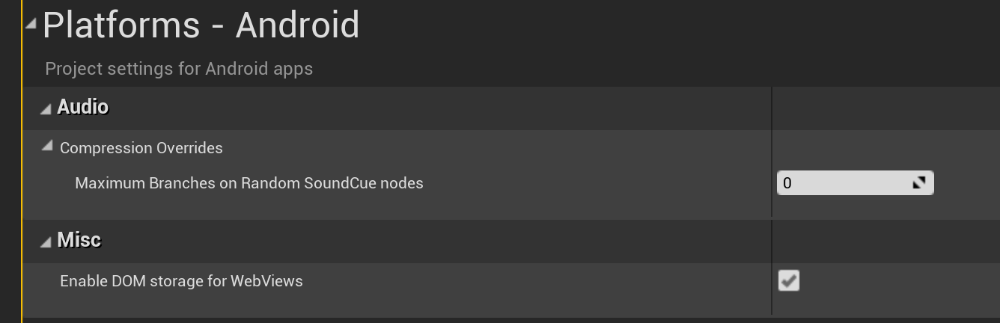

# UE4 插件使用，Web Brower打开网页
Web同事反馈了一个相关兼容问题，以之为例来看UE4插件的使用。
1. Web Browser为官方插件，在plugin界面搜索该插件并开启

2. 在控件栏中搜索并添加Web Browser控件

3. 设置Initail URL就可以访问

4. 如果是Android平台需要开启Dom Storage特性，否则部分页面打不开

## Tips

- [UWebBrowser插件官方文档地址](https://docs.unrealengine.com/4.27/en-US/API/Plugins/WebBrowserWidget/)
  
- 其实添加该插件后，就会发现生成的Android项目中自动包含了相关的权限以及com.epicgames.ue4.WebViewControl这个类。这个类的构造方法以及loadURL加载是在cpp中调用的.

  
- 该构造方法支持配置width，height, 是否使用透明背景（bUseTransparency）
以及是否开发H5 Dom Storage特性（bEnableDomStorage）。

- 调用该java方法的cpp文件的具体路径：Engine/Source/Runtime/WebBrowser/Private/Android/AndroidJavaWebBrowser.cpp。可见Android webview相关的代码是在引擎内核中的，与插件代码不在一起。
  
- 该cpp文件调用链：AndroidJavaWebBrowser.h -> AndroidWebBrowserWidget.h -> AndroidWebBrowserWindow.h -> WebBrowserSingleton.cpp-> 最终由plugin中的Engine/Plugins/Runtime/WebBrowserWidget/Source/WebBrowserWidget/Private/WebBrowserWidgetModule.cpp调用。
  
- WebBrowser插件的路径：Engine/Plugins/Runtime/WebBrowserWidget/WebBrowserWidget.uplugin。

## 相关参考文章

[UE4 WebBrowser插件版本](https://blog.csdn.net/weixin_44043951/article/details/122977676)

[UE4 使用Web Brower打开网页](https://blog.csdn.net/Highning0007/article/details/122897262)
